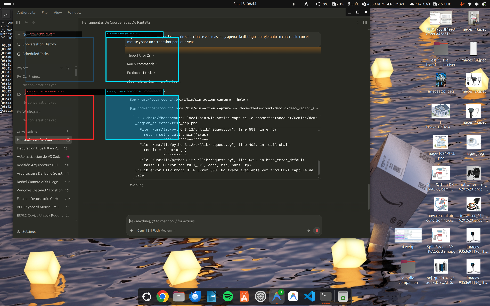
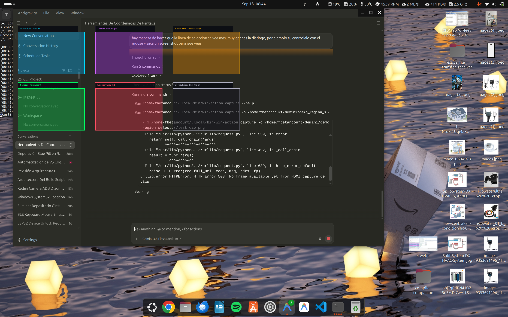

# 🎯 Screen Region Selector (Snagit-Style for Linux)

[](LICENSE)
[](#requirements)
[](demo_borders.sh)
[](region_picker.py)

A versatile collection of interactive screen region selectors for Linux (Ubuntu, Debian, Fedora, Arch) that display an on-screen crosshair and bounding box (Snagit / Flameshot / macOS style) and return precise rectangular coordinates, dimensions, and window geometries.

---

## 📸 Visual Previews

### 1. Solid High-Visibility Borders vs Faint 2px Lines
Standard default selectors often render faint 1–2px lines with low opacity that blend into modern dark IDEs. This project provides bold, fluorescent 4–10px borders for immediate visibility:



### 2. Snagit Shaded Tints Palette
Select regions with soft semi-transparent highlights (`-l` flag) across customizable color palettes and opacities:



---

## 📦 What's Included

| Script / Tool | Description |
| :--- | :--- |
| **`demo_tints.sh`** | Interactive CLI demo featuring the full Snagit Shaded Tint Gallery (Classic Cyan, Electric Violet, Neon Amber, Emerald, Crimson Coral, Frost Charcoal) with selectable opacity levels (20%, 35%, 50%). |
| **`demo_borders.sh`** | High-visibility solid border selector featuring 6px/10px bold outlines in Neon Cyan, Snagit Red, Electric Yellow, Lime Green, and Hot Pink. |
| **`snagit_selector.py`** | Standalone Python Tkinter fullscreen overlay with live crosshair guides, dynamic dimension badges near the cursor, and JSON stdout output. |
| **`region_picker.py`** | Reusable, clean Python wrapper module to integrate screen region selection directly into your Python automation, OpenCV, or testing projects. |

---

## 🚀 Quick Start

### 1. Requirements

Install `slop` (Select Operation) and `imagemagick` (optional, for automatic cropping):

```bash
# Ubuntu / Debian
sudo apt update && sudo apt install -y slop imagemagick

# Arch Linux
sudo pacman -S slop imagemagick

# Fedora
sudo dnf install slop ImageMagick
```

### 2. Make Executable

```bash
chmod +x demo_borders.sh demo_tints.sh snagit_selector.py
```

### 3. Run Demos

```bash
# Launch Snagit-style shaded tint demo
./demo_tints.sh

# Launch solid high-visibility border demo
./demo_borders.sh

# Launch native Python Tkinter selector
python3 snagit_selector.py
```

---

## 💻 Output Formats & CLI Usage

When selecting a region, tools print standardized coordinates and geometry to stdout:

```json
{
  "x": 420,
  "y": 215,
  "width": 800,
  "height": 600,
  "geometry": "800x600+420+215"
}
```

### Capturing Coordinates in Bash

```bash
# Read coordinates into bash variables
read -r X Y W H GEO < <(slop -f "%x %y %w %h %g" -l -c "0.0,0.7,1.0,0.35")
echo "Selected: Origin ($X, $Y), Dimensions ${W}x${H} px, Geometry: $GEO"
```

### Python Integration

```python
from region_picker import select_region_slop

# Capture shaded region
region = select_region_slop(mode="tint", color="0.0,0.7,1.0,0.35")

if region:
    print(f"X: {region['x']}, Y: {region['y']}")
    print(f"Size: {region['width']}x{region['height']}")
    print(f"Standard Geometry: {region['geometry']}")
else:
    print("Selection was cancelled.")
```

---

## 🛠️ Practical Recipes

### Record Selected Region with FFmpeg
```bash
GEO=$(slop -f "%wx%h %x,%y" -l -c "0.0,0.7,1.0,0.35")
SIZE=$(echo $GEO | cut -d' ' -f1)
OFFSET=$(echo $GEO | cut -d' ' -f2)

ffmpeg -f x11grab -framerate 30 -video_size "$SIZE" -i "$DISPLAY+$OFFSET" region_recording.mp4
```

### OCR Text Under Selected Region
```bash
GEO=$(slop -f "%wx%h+%x+%y" -b 6 -c "0.0,0.9,1.0,1.0")
import -window root -crop "$GEO" /tmp/ocr_snap.png
tesseract /tmp/ocr_snap.png stdout 2>/dev/null | xclip -selection clipboard
echo "Extracted text copied to clipboard!"
```

---

## 📄 License

This project is licensed under the [MIT License](LICENSE).
Created with ❤️ by [Francisco Betancourt](https://github.com/fbetancourt-dev).
